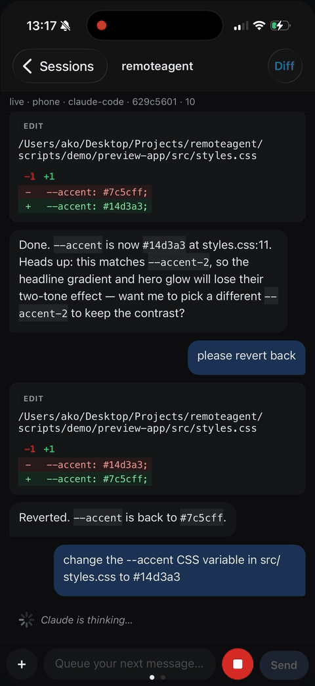

<p align="center">
  
</p>

<h1 align="center">Your coding agent. In your pocket.</h1>

<p align="center">
  Drive Claude Code (and friends) on your desktop from your phone.<br/>
  No cloud relay. No third-party server. Just your tailnet.
</p>

<p align="center">
  
</p>

<p align="center">
  <a href="https://aleksandrejavakhishvili.github.io/Rove/"><strong>Try the web client →</strong></a> &nbsp;·&nbsp;
  <a href="#quickstart"><strong>Quickstart</strong></a> &nbsp;·&nbsp;
  <a href="#why"><strong>Why</strong></a> &nbsp;·&nbsp;
  <a href="#live-preview"><strong>Live preview</strong></a> &nbsp;·&nbsp;
  <a href="#visual-feedback"><strong>Visual feedback</strong></a> &nbsp;·&nbsp;
  <a href="#comparison-with-similar-projects"><strong>vs. Happy</strong></a>
</p>

<p align="center">
  <sub>
    🔒 Peer-to-peer over Tailscale &nbsp;·&nbsp;
    🧠 Real diffs, real tool cards, real approvals &nbsp;·&nbsp;
    👁 Live dev-server preview, one swipe away &nbsp;·&nbsp;
    🪶 ~3 MB bridge, no DB, no daemon
  </sub>
</p>

---

## What it is

`rove` is two pieces you self-host on your own machines:

1. A **bridge** — tiny Node.js server you run alongside `claude` on your desktop. Drives Claude Code in-process via `@anthropic-ai/claude-agent-sdk` and exposes each session over HTTP + WebSocket on your tailnet.
2. A **client** — either the **Expo / React Native mobile app**, or the [hosted web client](https://aleksandrejavakhishvili.github.io/Rove/) running from your browser. Both read session history, stream tool calls + diffs as they happen, surface approval prompts as bottom sheets, and preview the dev server your agent is editing right next to the chat.

Your laptop runs the agent. Your phone (or browser) is the editor surface. Tailscale is the network. Nothing in between.

## Why

Existing mobile clients (Happy, etc.) work — but they route your turns through their own infrastructure, even with end-to-end encryption. `rove` is for the case where you want **zero third-party touch**: your laptop runs the agent, your phone runs the client, Tailscale tunnels the bytes, and nobody else is in the path.

## Status

Early. Works end-to-end with Claude Code today; Codex / Aider / Gemini drivers are scaffolded but unimplemented. APIs may change.

## Architecture

```
┌────────────────────┐                          ┌────────────────────────────────────┐
│ Phone (Expo RN) or │                          │ Your desktop                       │
│ browser (web)      │                          │                                    │
│                    │   Tailscale tunnel       │  bridge (Hono + WebSocket)         │
│  - Sessions list   ├──── HTTPS / WSS ────────►│   ├─ /sessions  /sessions/:agent/  │
│  - Chat view       │                          │   ├─ @anthropic-ai/claude-agent-sdk│
│  - File / diff     │                          │   ├─ canUseTool → permission gate  │
│  - Approval sheets │                          │   ├─ FileChanged hook (file events)│
│                    │                          │   └─ git diff helpers              │
└────────────────────┘                          │                                    │
                                                │  ~/.claude/projects/.../*.jsonl    │
                                                │  your repositories                 │
                                                └────────────────────────────────────┘
```

Sessions live as JSONL files in `~/.claude/projects/`. The bridge runs Claude Code in-process via the agent SDK, streams normalized events over WebSocket, and forwards approval requests through the SDK's `canUseTool` callback straight to your phone — no subprocess hop, no separate MCP server.

See [`docs/ARCHITECTURE.md`](docs/ARCHITECTURE.md) for the full picture and [`docs/WIRE_PROTOCOL.md`](docs/WIRE_PROTOCOL.md) for the event schema.

## Quickstart

You'll need:

- macOS or Linux with **Node 22+**, **pnpm**, and **Tailscale** installed and logged in.
- **`claude` CLI** installed and authenticated (`claude /login`).
- An iPhone or Android phone with **Tailscale** and **Expo Go** installed (Expo Go is for dev; see [Production builds](#production-builds) for standalone apps).

### 1. Clone and install

```bash
git clone <repo-url> rove
cd rove

# Bridge
cd bridge && pnpm install && cd ..

# Mobile
cd mobile && pnpm install && cd ..
```

### 2. Run the bridge

```bash
cd bridge
pnpm start
```

<p align="center">
  
</p>

That's it. The bridge:

- Raises its own file-descriptor limit.
- Auto-detects your Tailscale device-owner email and restricts access to you.
- Requests a Let's Encrypt cert for your `.ts.net` hostname so the phone can connect over real HTTPS.
- Detects whether `tailscale serve` is running and prints a QR code with the right URL.

For TLS + zero-token setup, run this once on the same machine (persists across reboots):

```bash
sudo tailscale serve --bg --https=443 http://127.0.0.1:8443
```

See [`bridge/SETUP.md`](bridge/SETUP.md) for all deployment modes (LAN, Tailscale IP, Tailscale serve + TLS).

### 3. Run the mobile app

```bash
cd mobile
pnpm start
```

Scan the QR with Expo Go on your phone.

### 4. Connect

In the app: **Settings → Scan QR from the bridge** → point camera at the QR printed by the bridge. URL and token auto-fill, the app tests the connection, and you're in.

## Repo layout

```
.
├── bridge/                 # Node.js bridge that runs alongside claude on your desktop
│   ├── src/
│   │   ├── server.ts       # Hono HTTP + WebSocket server
│   │   ├── runtime.ts      # Per-session lifecycle manager
│   │   ├── agents/         # AgentDriver interface + SDK-backed Claude Code driver
│   │   ├── permissions.ts  # Cross-session approval registry (canUseTool → user)
│   │   ├── tailscale.ts    # Tailscale detection
│   │   └── ...
│   ├── bin/                # CLI entry (for npx rove-bridge)
│   └── SETUP.md            # Deployment modes
├── mobile/                 # Expo React Native + web app
│   ├── app/                # Expo Router screens
│   ├── components/         # Chat UI, markdown, code blocks, scanner
│   └── lib/                # Transport, store, types
└── docs/
    ├── ARCHITECTURE.md
    ├── WIRE_PROTOCOL.md
    └── web-client-setup.md # Pointing the live web client at your bridge
```

## Production builds

For Android: `cd mobile && eas build --platform android --profile preview`. The resulting APK installs on any Android phone, no developer account needed.

For iOS: requires the Apple Developer Program ($99/year) for permanent installs via TestFlight, or use a free Apple ID + Xcode for ad-hoc installs that re-sign every 7 days. See `mobile/README.md`.

## Multi-user

Default behavior: only the device owner (auto-detected from Tailscale) can connect. To share with others:

```bash
ALLOWED_USERS=you@example.com,friend@example.com pnpm start
```

Each friend joins your tailnet (you invite them via the Tailscale admin UI) and installs the mobile app on their phone. Their Tailscale identity is validated against `ALLOWED_USERS` on every request.

## Live preview

Swipe left from the chat in any session to see a WebView of the dev server running for that project — no configuration. ([See it in action at the top of this README.](#)) The bridge scans listening TCP ports on your desktop and matches any process whose working directory sits inside the session's cwd. Vite, Next.js, Astro, webpack, Parcel, Bun and plain `node` servers are auto-labeled; multiple candidates (e.g. backend + frontend in a monorepo) appear in a picker. Rename any entry to whatever's meaningful ("Admin FE", "Storefront API", …) — labels persist per session.

Caveats:

- The dev server must bind to `0.0.0.0` (or `::`), not `127.0.0.1`. If it's localhost-only the pane shows a framework-specific hint instead of a broken WebView (`vite --host`, `next dev -H 0.0.0.0`, etc.).
- The bridge sees what your user can see — don't run dev servers under `sudo`, they'll be invisible to `lsof`. Port 3000 etc. never needs root.
- Requires `react-native-webview`, a native module — use a dev build (`npx expo run:ios` / `run:android`) or an EAS build. Expo Go can't load it.

## Visual feedback

The agent can verify its own frontend changes by capturing the dev-server preview directly. When Claude calls the `take_screenshot` MCP tool, the phone briefly takes over the screen — swaps to the Preview pane, optionally navigates to a path the agent specifies, captures the WebView, and returns the pixels as an image tool result. A "Verifying — `/path`" pill at the top of the screen makes the takeover visible and exposes a Cancel button; the mode auto-exits after a short debounce and restores wherever you were.

Off by default. Flip **Settings → Visual feedback** to enable it. The first call per session goes through the usual permission sheet ("Allow once / Always allow / Deny"). A secondary **Always ask before each capture** switch in the same screen suppresses "Always allow" if you'd rather grant capture explicitly every time.

Each `screenshot_result` echoes back the WebView's final URL alongside the image — so if the agent asks for `/admin` and the server bounces to `/login`, the redirect is visible to the model without it having to read the pixels. Path arguments are validated on the phone (no cross-origin, no `..` traversal).

## Adding a new agent

The `AgentDriver` interface in `bridge/src/agents/types.ts` is the extension point. To add Codex / Aider / Gemini / your-own-CLI:

1. Implement `AgentDriver` for it: how to list sessions, read history, spawn the CLI in headless mode, translate its events into our normalized `AgentEvent` schema.
2. Register it in `bridge/src/agents/registry.ts`.
3. Optionally add tool-card layouts for its native tools in `mobile/components/chat/ToolCard.tsx` (or rely on the generic fallback).

That's the whole surface. The transport, mobile UI, approval flow, file watcher, and pagination are all agent-agnostic.

See [`docs/WIRE_PROTOCOL.md`](docs/WIRE_PROTOCOL.md) for the event schema and [`docs/ARCHITECTURE.md`](docs/ARCHITECTURE.md) for where the seams are.

## Comparison with similar projects

- **[Happy](https://github.com/slopus/happy)** — Polished, ships in app stores, supports Claude Code + Codex + Gemini + more. Uses their hosted server for sync (E2E encrypted). If you want a real product right now, install Happy. `rove` exists for the case where "encrypted relay through someone else's server" isn't quite the property you want.
- **`tmux` + Blink/Termux over SSH** — The closest thing to no-code. Works today, gives you full TUI fidelity, but the phone-side UX is "terminal on a tiny screen". `rove` is a phone-native chat UI on top of the same `claude` session files.

## License

MIT — see [`LICENSE`](LICENSE).

## Contributing

See [`CONTRIBUTING.md`](CONTRIBUTING.md). Bugs, driver implementations for other agents, and polish for less-common terminals/devices are all welcome.
