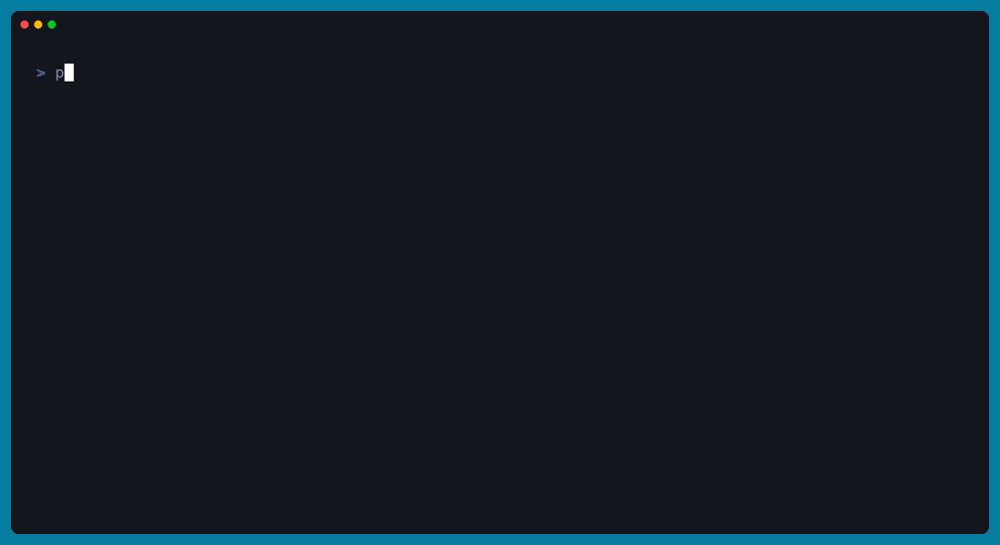

<p align="center">
  <strong>Control your local coding agents from your phone, over your own Tailscale.</strong><br/>
  No central server. No cloud relay. Your code never leaves your machine.
</p>

<p align="center">
  
</p>

---

`rove` is two things:

1. A **bridge** — a tiny Node.js server you run on your desktop next to `claude` (or, soon, other CLI agents). It talks to the agent through its headless mode and exposes the session over a private network as HTTP + WebSocket.
2. A **mobile app** (Expo / React Native) that connects to the bridge from your phone, lets you read history, send prompts, watch tool calls execute on your machine, approve risky operations, and review file diffs — all over Tailscale, end-to-end-tunnelled through WireGuard.

The whole architecture is peer-to-peer between your devices. No third-party server holds your session, your API key, or your code.

## Why

Existing mobile clients for coding agents (Happy, etc.) work, but they route through their own infrastructure even with end-to-end encryption. `rove` is for the case where you want zero third-party touch: your laptop runs the agent, your phone runs the client, Tailscale is the network. That's it.

## Status

Early. Works end-to-end with Claude Code today; Codex / Aider / Gemini drivers are scaffolded but unimplemented. APIs may change.

## Architecture

```
┌────────────────────┐                          ┌────────────────────────────────────┐
│ Phone (Expo RN)    │                          │ Your desktop                       │
│                    │                          │                                    │
│  - Sessions list   │   Tailscale tunnel       │  bridge (Hono + WebSocket)         │
│  - Chat view       ├──── HTTPS / WSS ────────►│   ├─ /sessions  /sessions/:agent/  │
│  - File / diff     │                          │   ├─ spawns claude -p as needed    │
│  - Approval sheets │                          │   ├─ chokidar (file changes)       │
│                    │                          │   └─ git diff helpers              │
└────────────────────┘                          │                                    │
                                                │  claude CLI (authenticated)        │
                                                │  ~/.claude/projects/.../*.jsonl    │
                                                │  your repositories                 │
                                                └────────────────────────────────────┘
```

Sessions live as JSONL files in `~/.claude/projects/`. The bridge spawns `claude -p --resume <id>` per turn, streams normalized events over WebSocket, and forwards approval requests through an MCP permission-prompt tool back to the phone.

See [`docs/ARCHITECTURE.md`](docs/ARCHITECTURE.md) for the full picture and [`docs/WIRE_PROTOCOL.md`](docs/WIRE_PROTOCOL.md) for the event schema.

## Quickstart

You'll need:

- macOS or Linux with **Node 22+**, **pnpm**, and **Tailscale** installed and logged in.
- **`claude` CLI** installed and authenticated (`claude /login`).
- An iPhone or Android phone with **Tailscale** and **Expo Go** installed (Expo Go is for dev; see [Production builds](#production-builds) for standalone apps).

### 1. Clone and install

```bash
git clone <repo-url> rove
cd rove

# Bridge
cd bridge && pnpm install && cd ..

# Mobile
cd mobile && pnpm install && cd ..
```

### 2. Run the bridge

```bash
cd bridge
pnpm start
```

<p align="center">
  
</p>

That's it. The bridge:

- Raises its own file-descriptor limit.
- Auto-detects your Tailscale device-owner email and restricts access to you.
- Requests a Let's Encrypt cert for your `.ts.net` hostname so the phone can connect over real HTTPS.
- Detects whether `tailscale serve` is running and prints a QR code with the right URL.

For TLS + zero-token setup, run this once on the same machine (persists across reboots):

```bash
sudo tailscale serve --bg --https=443 http://127.0.0.1:8443
```

See [`bridge/SETUP.md`](bridge/SETUP.md) for all deployment modes (LAN, Tailscale IP, Tailscale serve + TLS).

### 3. Run the mobile app

```bash
cd mobile
pnpm start
```

Scan the QR with Expo Go on your phone.

### 4. Connect

In the app: **Settings → Scan QR from the bridge** → point camera at the QR printed by the bridge. URL and token auto-fill, the app tests the connection, and you're in.

## Repo layout

```
.
├── bridge/                 # Node.js bridge that runs alongside claude on your desktop
│   ├── src/
│   │   ├── server.ts       # Hono HTTP + WebSocket server
│   │   ├── runtime.ts      # Per-session subprocess manager
│   │   ├── agents/         # AgentDriver interface + ClaudeCodeDriver
│   │   ├── mcp/            # MCP permission-prompt server (spawned by claude)
│   │   ├── tailscale.ts    # Tailscale detection
│   │   └── ...
│   ├── bin/                # CLI entry (for npx rove-bridge)
│   └── SETUP.md            # Deployment modes
├── mobile/                 # Expo React Native app
│   ├── app/                # Expo Router screens
│   ├── components/         # Chat UI, markdown, code blocks, scanner
│   └── lib/                # Transport, store, types
└── docs/
    ├── ARCHITECTURE.md
    └── WIRE_PROTOCOL.md
```

## Production builds

For Android: `cd mobile && eas build --platform android --profile preview`. The resulting APK installs on any Android phone, no developer account needed.

For iOS: requires the Apple Developer Program ($99/year) for permanent installs via TestFlight, or use a free Apple ID + Xcode for ad-hoc installs that re-sign every 7 days. See `mobile/README.md`.

## Multi-user

Default behavior: only the device owner (auto-detected from Tailscale) can connect. To share with others:

```bash
ALLOWED_USERS=you@example.com,friend@example.com pnpm start
```

Each friend joins your tailnet (you invite them via the Tailscale admin UI) and installs the mobile app on their phone. Their Tailscale identity is validated against `ALLOWED_USERS` on every request.

## Adding a new agent

The `AgentDriver` interface in `bridge/src/agents/types.ts` is the extension point. To add Codex / Aider / Gemini / your-own-CLI:

1. Implement `AgentDriver` for it: how to list sessions, read history, spawn the CLI in headless mode, translate its events into our normalized `AgentEvent` schema.
2. Register it in `bridge/src/agents/registry.ts`.
3. Optionally add tool-card layouts for its native tools in `mobile/components/chat/ToolCard.tsx` (or rely on the generic fallback).

That's the whole surface. The transport, mobile UI, approval flow, file watcher, and pagination are all agent-agnostic.

See [`docs/WIRE_PROTOCOL.md`](docs/WIRE_PROTOCOL.md) for the event schema and [`docs/ARCHITECTURE.md`](docs/ARCHITECTURE.md) for where the seams are.

## Comparison with similar projects

- **[Happy](https://github.com/slopus/happy)** — Polished, ships in app stores, supports Claude Code + Codex + Gemini + more. Uses their hosted server for sync (E2E encrypted). If you want a real product right now, install Happy. `rove` exists for the case where "encrypted relay through someone else's server" isn't quite the property you want.
- **`tmux` + Blink/Termux over SSH** — The closest thing to no-code. Works today, gives you full TUI fidelity, but the phone-side UX is "terminal on a tiny screen". `rove` is a phone-native chat UI on top of the same `claude` session files.

## License

MIT — see [`LICENSE`](LICENSE).

## Contributing

See [`CONTRIBUTING.md`](CONTRIBUTING.md). Bugs, driver implementations for other agents, and polish for less-common terminals/devices are all welcome.
